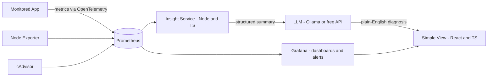

# AGENTS.md — Personal AI-Powered APM System

## Project Summary
Build a personal application performance monitoring (APM) tool, similar to Grafana/Datadog, that additionally:
- Uses AI to suggest likely causes of performance bottlenecks and forecast future issues
- Reports each monitored app's *empirical* time/space complexity (how latency and memory scale with real load), in plain language
- Estimates how much usage/load it takes before a metric crosses into an unhealthy/critical range, and when that will happen at the current trend

Single user, personal project. Optimize for zero ongoing cost, not for scale.

## Hard Constraints (do not violate)
- $0/month budget. Every component must be free-tier or self-hosted open source. If something would incur cost, flag it before implementing instead of proceeding.
- Personal/single-user scope — do not add multi-tenancy, auth systems, or billing.
- "Complexity" means empirical curve-fitting over real runtime metrics (see Complexity Model below) — do not attempt static source-code Big-O analysis.
- Treat all LLM-generated diagnoses as hypotheses, not verified facts. Always render an AI explanation next to the raw metrics that produced it, never standalone.

## Tech Stack (decided — do not substitute without flagging why)
| Layer | Choice | Notes |
|---|---|---|
| Instrumentation | OpenTelemetry SDK / Prometheus client | inside the monitored app |
| Time-series store | Prometheus, self-hosted | not Grafana Cloud — its free tier's 14-day retention is too short for trend forecasting |
| Host/container metrics | Node Exporter, cAdvisor | standard Prometheus companions |
| Dashboards + alerting | Grafana OSS, self-hosted | |
| Insight service | Node.js + TypeScript | fixed choice |
| AI narrative | Ollama (local model) by default; Google Gemini free tier (AI Studio) or Groq free tier as fallback | never call the LLM more than once per 15 minutes |
| Frontend ("simple view") | React + TypeScript | |
| Local orchestration | Docker Compose | default deployment target is the user's own machine |
| Optional always-on hosting | Oracle Cloud "Always Free" VM (2 OCPU / 12 GB RAM Ampere A1 as of 2026) | only if 24/7 monitoring of a remotely-deployed app is needed |

## Architecture


## Repository Structure
```
apm-system/
├── AGENTS.md
├── CLAUDE.md                     # one-line @AGENTS.md import, for Claude Code
├── docker-compose.yml
├── prometheus/
│   └── prometheus.yml
├── grafana/
│   └── provisioning/
│       ├── dashboards/
│       └── datasources/
├── services/
│   └── insight-service/
│       ├── package.json
│       ├── tsconfig.json
│       └── src/
│           ├── index.ts
│           ├── promql.ts         # query Prometheus
│           ├── complexity.ts     # curve fitting (time + space)
│           ├── forecast.ts       # trend extrapolation / runway calc
│           ├── llm.ts            # Ollama / Gemini / Groq client
│           └── thresholds.ts     # green/yellow/red band config
└── dashboard/
    ├── package.json
    └── src/
        ├── App.tsx
        └── components/
            ├── HealthBand.tsx
            ├── ComplexityCard.tsx
            └── InsightPanel.tsx
```

## Metrics to Collect
| Category | Metric | Source |
|---|---|---|
| Speed | p50/p95/p99 latency, req/s | OpenTelemetry / app instrumentation |
| Storage | Disk usage & growth rate, DB size, log volume | Node Exporter / app |
| Memory | RSS/heap usage over time | Node Exporter / app runtime |
| Duration | Job/batch/request completion time | app instrumentation |
| Reliability | Error rate, uptime, restart count | app instrumentation |
| Capacity | % of threshold used per metric, forecasted days-to-critical | insight-service (derived) |

Every metric needs a configurable green/yellow/red threshold, defined in `thresholds.ts`.

## Complexity Model (empirical — not static code analysis)
**Time:** For each endpoint/job, collect `(load, p95 latency)` pairs — load can be concurrent requests, payload size, or rows processed. Fit against candidate curves (constant, log n, n, n log n, n²) and report whichever fits best, in plain language ("scales roughly linearly with load").

**Space:** Same approach for `(data volume, memory RSS)` pairs.

**Runway to critical:** Fit a linear trend to a metric's recent history and extrapolate to its configured critical threshold. Output: estimated time until that metric crosses into critical, if the trend holds.

## AI Insight Layer
Two tiers — always run tier 1; only escalate to tier 2 on a schedule, never per-request:
1. **Rule-based (always-on, instant, free):** threshold-crossing detection, spike detection, simple correlation (e.g. a latency spike aligned with a CPU or connection-pool spike).
2. **LLM synthesis (rate-limited, occasional):** feed tier 1's structured summary (not raw time series) to the configured LLM every 15–30 minutes to produce a plain-English hypothesis + suggestion.

## Requirements
- WHEN a monitored endpoint has at least 5 distinct load levels recorded THE SYSTEM SHALL fit and report an empirical time-complexity estimate for that endpoint.
- WHEN a tracked metric's recent trend, linearly extrapolated, would cross its critical threshold THE SYSTEM SHALL report an estimated time-to-critical.
- WHEN the rule-based layer detects a threshold crossing or correlated anomaly THE SYSTEM SHALL generate an LLM-based plain-English explanation on the next scheduled AI-insight cycle.
- WHEN an LLM-based explanation is displayed THE SYSTEM SHALL show the underlying metric values alongside it.
- WHEN any component would require a paid tier or exceed a documented free-tier limit THE SYSTEM SHALL flag this rather than silently proceeding.

## Build Plan (execute in order)

### Phase 1 — Foundation
- [ ] Instrument one target app with an OpenTelemetry/Prometheus client (latency, throughput, error rate)
- [ ] `docker-compose.yml` bringing up Prometheus + Grafana + Node Exporter (+ cAdvisor if containerized)
- [ ] `prometheus/prometheus.yml` scrape config for the app and exporters
- [ ] 3–4 basic Grafana dashboards: latency, error rate, CPU/memory
- **Acceptance:** Grafana shows live data from the app and host within 5 minutes of `docker compose up`

### Phase 2 — Thresholds & Alerts
- [ ] `thresholds.ts`: green/yellow/red bands per metric
- [ ] Grafana alert rules wired to a free webhook (Discord/Telegram/email)
- **Acceptance:** crossing a configured threshold fires a real notification

### Phase 3 — Complexity & Forecasting Engine
- [ ] `promql.ts`: query Prometheus for (load, latency) and (volume, memory) series
- [ ] `complexity.ts`: curve-fitting against candidate complexity classes
- [ ] `forecast.ts`: linear trend + days-to-critical calculation
- [ ] Expose results via a small JSON API from `insight-service`
- **Acceptance:** the insight-service API returns a complexity label and a runway estimate for at least one real endpoint

### Phase 4 — AI Narrative Layer
- [ ] `llm.ts`: client for Ollama (default), with Gemini/Groq fallback
- [ ] Wire tier-1 rule-based summary → LLM → plain-English output, on a 15–30 min schedule
- [ ] `dashboard/`: React+TS view showing health bands, complexity cards, and the AI insight panel next to the raw metrics
- **Acceptance:** the dashboard shows at least one AI-generated explanation next to the data that produced it

## Non-Goals
- Not multi-tenant, not for production/enterprise scale
- No static source-code complexity analysis
- No paid infrastructure of any kind without explicit approval

## Free-Tier Reference (verified Sept 2026 — re-check before relying on long-term)
| Service | Free allowance | Caveat |
|---|---|---|
| Grafana OSS | Unlimited (self-hosted) | you maintain it |
| Grafana Cloud Free | 10k metric series, 50 GB logs, 14-day retention | too short for forecasting; fine for dashboards only |
| Oracle Cloud Always Free | 2 OCPU / 12 GB RAM Ampere A1 (cut from 4/24 in 2026) + 2 AMD micro VMs | card required for verification, not charged |
| AWS Always Free | 1M Lambda req/month, 25 GB DynamoDB, 10 CloudWatch custom metrics | AWS's broader free tier changed July 2025 to a 6-month credit model, not a rolling 12-month free EC2 |
| Google Gemini API free tier | Rate-limited, project-based (AI Studio) | fine for a 15–30 min polling schedule |
| Groq free tier | ~30 req/min, 1,000/day | published limits, not guaranteed |

## How this file is read by your tools
- **Cursor, Kiro, and most current coding agents** auto-detect `AGENTS.md` at the repo root — just drop this file in and open the project.
- **Kiro** also reads `AGENTS.md` natively as a steering document. If you want its full spec-driven workflow (tracked `requirements.md` / `design.md` / `tasks.md` under `.kiro/specs/`), ask Kiro to generate a spec from this file.
- **Claude Code** primarily reads `CLAUDE.md`. The companion `CLAUDE.md` in this repo is a one-line `@AGENTS.md` import so Claude Code loads this same content via its native import syntax.
